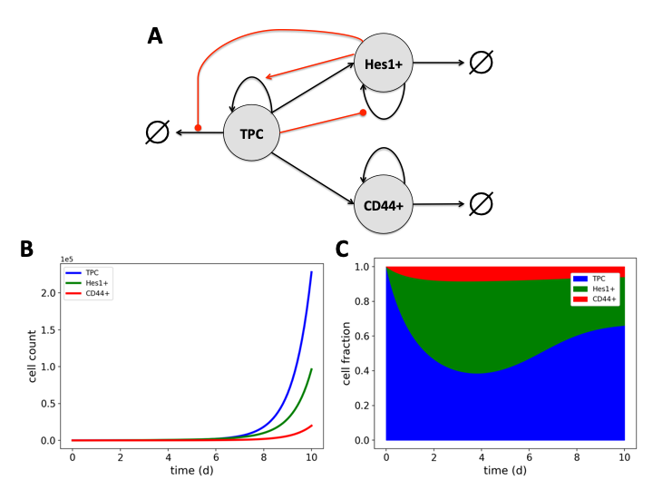

# CurrOpinSysBiol_2019

Three-species SCLC model presented in Harris et al. (2019) "Modeling heterogeneous tumor growth dynamics and cell-cell interactions at single-cell and cell-population resolution", Curr Opin Syst Biol. The model is constructed in PySB. Instructions for downloading and installing PySB can be found at http://pysb.org. Additional help is available in the PySB chat room at https://gitter.im/pysb/pysb.

The model is comprised of three cell types: tumor-propagating cells ('TPC'), Hes1+/NOTCH-active cells ('Hes1'), and CD44+ cells ('CD44'). All cell types can divide and die and TPCs can differentiate into Hes1+ and CD44+ cells. TPC division is enhanced by Hes1+ cells, TPC death is inhibited by Hes1+ cells, and Hes1+ cell division is inhibited by TPCs. Rate expressions for these processes are given in Eq. (2) of Harris et al. (2019), which is based on a simple reaction motif describing the dynamics of secreted factors. Rates for all other processes are assumed to obey simple mass-action kinetics. 

Code is also included that reproduces Figs. 2B and 2C of Harris et al. (2019) (cell counts and cell fractions vs. time, respectively). 

Please direct any questions about the model to Leonard A. Harris at l.harris@vanderbilt.edu.

